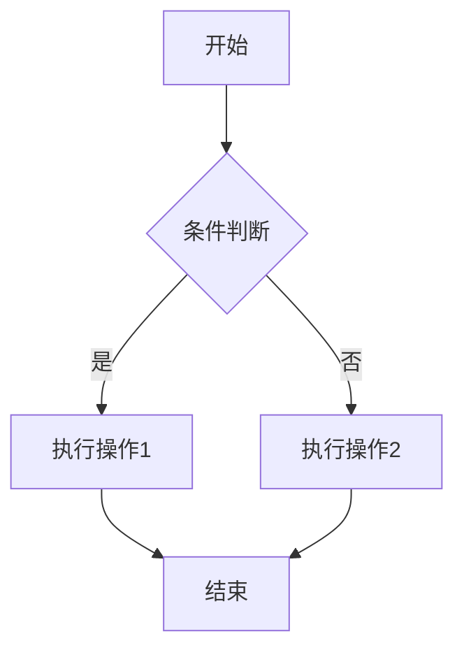

## 为什么学 MD
MD是一个轻量级别的文本格式，在当今的时代重要性仅次于JSON，广泛应用于开发、文章博客、技能展示等场景，甚至可以拿来写CV（个人简历），所以学会md是必要的。

你也可以参考这篇文章进行学习：[https://forum-zh.obsidian.md/t/topic/435](https://forum-zh.obsidian.md/t/topic/435)

你也可以参考我写的一下常用语法，怎么使用呢？<font color = "red">点到对应的例子上，你能看到他是怎么写的（这个就可以点，这是一个修改文本颜色的设置）</font>

## 六个标题
一个井号代表`#`一级标题，两个代表二级标题，以此类推，直到六个
# 你好
## 你好
### 你好
#### 你好
##### 你好
###### 你好

## 字体文本相关

`你好，这是行级代码标注`

```bash
你好，这是块级代码标注
```

==你好，这是文本强调==

*你好，这是文本斜体*

**你好，这是文本加粗**

~~你好，这是中划线~~

%% 你好，这是注释 %%

>你好，这也是注释

1. 你好这是有顺序序号 1
2. 你好这是有顺序序号 2

- 你好，这是无顺序序号 1 （使用-就可以，与 > 注释用法类似）
- 你好，这是无顺序序号 2

## 引用相关
注意删掉 \ 符号：

[这里访文本]\(这里放链接地址)

比如这个就引向了我的博客：[点击](https://elysia.wiki:223)

![图片描述]\(图片的链接地址)

比如（把光标移动到冒号右边查看详细的写法）：

## 其他（进阶，可以不学）

### mermaid 流程图语法

mermaid 流程图语法，你可以点击这张图的右上角查看相关的代码：



### Latex数学公式语法

$你好，这是行级Latex数学公式（\alpha、\sigma）$

$$你好，这是块级Latex数学公式。极大似然公式：P(D_c|\theta_c)=\prod_{x\in D_c}P(x|\theta_c)$$

注：数学公式需要学会`Latex`语法，拿出去可以作为科研（~~装逼~~）工具，比如下面这个（支持向量机在核化和回归下的公式，SVR）：
$$
\begin{align}

&L(w, b, \alpha, \hat{\alpha}, \xi, \hat{\xi}, \mu, \hat{\mu})\nonumber \\

&= \frac{1}{2} \|w\|^2 + C \sum_{i=1}^{m} (\xi_i + \hat{\xi}_i) - \sum_{i=1}^{m} \mu_i \xi_i - \sum_{i=1}^{m} \hat{\mu}_i \hat{\xi}_i \nonumber \\

&+ \sum_{i=1}^{m} \alpha_i \big( f(x_i) - y_i - \epsilon - \xi_i \big) + \sum_{i=1}^{m} \hat{\alpha}_i \big( y_i - f(x_i) - \epsilon - \hat{\xi}_i \big) .\nonumber

\end{align}
$$